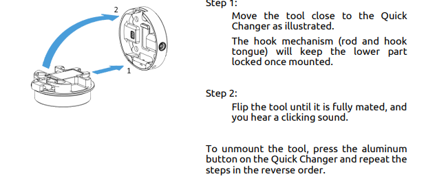
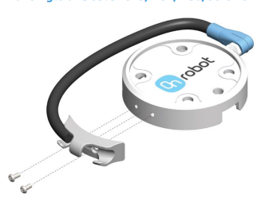
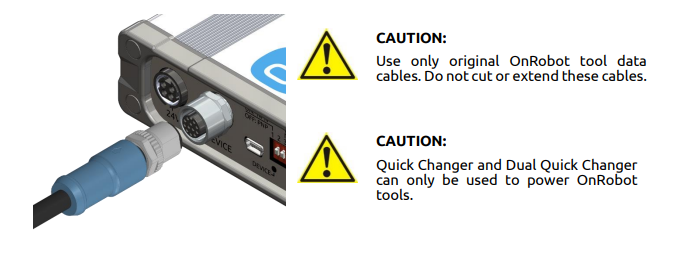
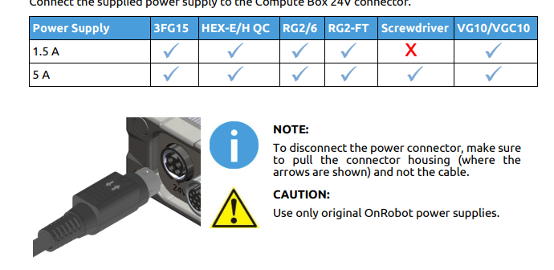
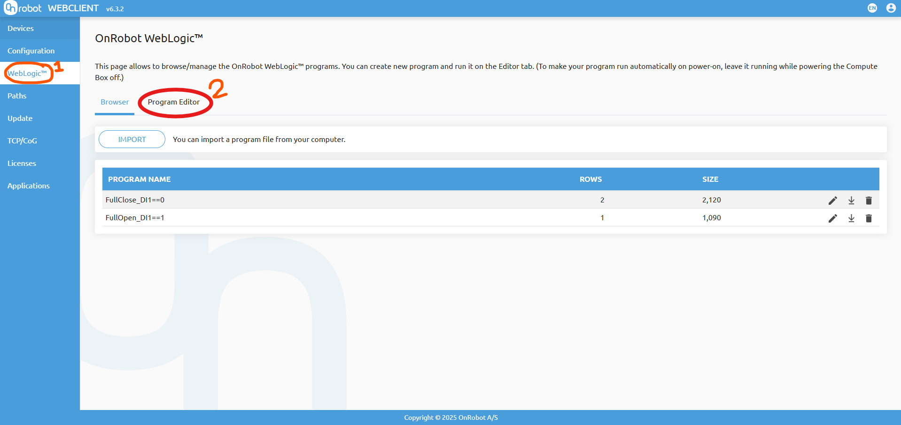

# OnRobot 3FG15 ->Fairino setup
This repo contains a README with steps to set up controls for your OnRobot 3 Finger Gripper (3FG)

### Step 1: Connecting your gripper and the OnRobot control box
Connect your gripper to the mounting plate by sliding the metal bar into the latch of the plate (shown below):

Now, connect the 
Find the m8 to m12 connection cable in the OnRobot box. Connect this wire to the quick changer as shown here (wire bracket optional):

Now, you can connect the other end of the data cable to the OnRobot control box using the m12 port on the front (shown below):

Finally, use a kettle lead and the provided 24v adapter to the OnRobot control box (shown below):

### Step 2: Wiring of the Fairino control box and OnRobot control box
First, you'll want to take your external power supply and connect the positive to the E-24v port on the top rail and the ground to any E-0v port on the Fairino control box

Find and insert the green screw terminal block for the back of the OnRobot box.

After inserting the screw terminal block, use one of the provided wires to connect the GND pin of the OnRobot control box to another E-0v pin on the Fairino control box.

Finally, grab the other green screw terminal for the DI block of the OnRobot Control box. This is what will give your griper IO communication with your Fairino Control Box

Now, your wiring set up should look like this:

    OnRobot Control Box
        L screw terminal block
        |    L GND->Fairino:E-0v
        |
        L Device cable -> OnRobot gripper bracket
        |
        L 24V port -> kettle lead -> wall outlet
        |
        L DI screw terminal
            L DIx <-> Fairino:DOx

    Fairino Control Box
        L IO Terminal Block
        |    L E-24V -> Power supply (+)
        |    L E-0V -> Power supply (-)
        L DOx <-> OnRobot:DIx

### Step 3: Creating your gripper program
Connect your ethernet cable from your OnRobot control box to your computer.

In any browser, type in the IP address of your OnRobot control box (default 192.168.1.1) to navigate to the WebClient.

Now, navigate to (1)"WebLogic" -> (2)"Program Editor"

*Thank you to OnRobot for providing images from the User Manual*